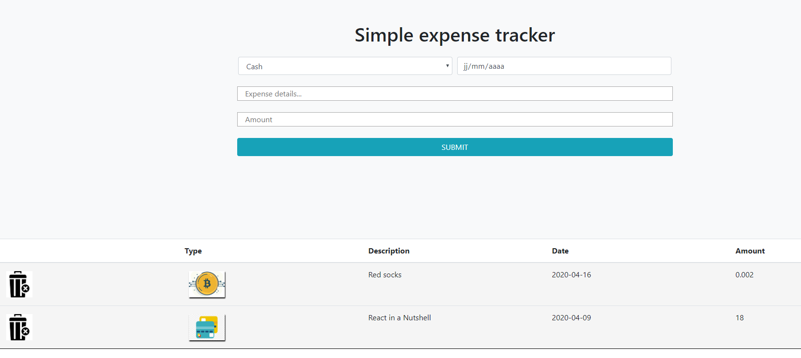

## Expense tracker app(React)

**_Simple expense tracker in React and Bootstrap_**

Demo [here](http://mastermind-expense_tracker.herokuapp.com/)

### Summary

5th  app done in my roadmap to become a fullstack web developper. 

Expense tracker allows you to keep record of your expenses. You can choose between Cash, Card, Crypto or other type 
of transaction.

Your expense is recorded in local storage so your data can be retrieved even if you refresh the page.
You can add as much as items you want and also delete each one.

I used cutting edge front end technologies like **React** and **Bootstrap** for this projet.

Regarding Bootstrap i am now familiar with the grid system and some components(forms, buttons...).

Regarding react, i know how to organize my app into components, pass data between them update states.

It was a lot of headaches at first but now i'm more confident in the skills i developed in those frameworks.

### Author

**_Gilchrist TOSSOU_** - Full stack web developer/ data engineer [LinkedIn](https://linkedin.com/in/gilchrist-tossou-a9663743/)

